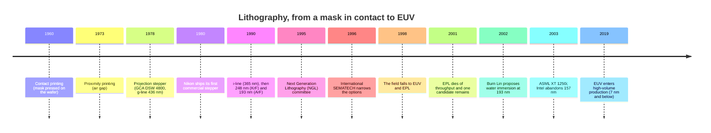

# History of photolithography

Optical lithography went through four machine arrangements before reaching today's scanner <Cite id="kato-litho" />. This page follows that path: how the industry chose a next-generation lithography, why nearly every candidate lost, and why **the 193 nm of 2002 still carries the advanced nodes**. For how the process works today, see [Photolithography](/en/fotolitografia).

## Timeline

## The four optical generations

<DiagramFigure src="/assets/lithography-generations.svg" alt="Comparison of contact printing, proximity printing, 1:1 projection printing and the reduction stepper">
The four machine arrangements compared. Drawn by the author.
</DiagramFigure>

In the early decades, integrated circuits were exposed by **contact printing**: the mask was pressed **physically** against the wafer. The arrangement is simple and cheap — it uses no lens at all — but repeated contact **damages the mask and contaminates the wafer** <Cite id="kato-litho" />.

In **1973** came **proximity printing**, which introduces an air gap between mask and wafer. The wear disappears, but diffraction worsens the **resolution** — still with no lens in the path <Cite id="kato-litho" />. Then **projection printing** added **lenses** to the system, and that became the basis of everything that followed <Cite id="kato-litho" />.

In **1978** GCA launched the **DSW 4800**, the first successful wafer **stepper**: **10×** reduction optics, a Zeiss lens with 0.28 numerical aperture, a 10 × 10 mm field and **g-line (436 nm)** light <Cite id="kato-litho" />. Instead of exposing the whole wafer in one shot, the machine **steps from field to field**. Nikon launched its first commercial stepper in 1980.

The stepper did not win by being better at everything. A 10× stepper managed about **11 100 mm wafers per hour**, against **40** for a projection aligner, and cost around **US$450–600 thousand** against **US$240 thousand** for its rival <Cite id="chiphistory-litho" />. It won on **cost per good die**, and because once features crossed the 1 µm mark, only the stepper delivered the resolution <Cite id="chiphistory-litho" />. Today the same arrangement costs **US$50–60 million** and processes more than **200 300 mm wafers per hour** <Cite id="chiphistory-litho" />.

### The wavelengths

<DiagramFigure src="/assets/spectrum-of-lithography-lights.png" alt="Spectrum of the lights used in lithography: g-line 436 nm, i-line 365 nm, KrF 248 nm, ArF 193 nm and F2 157 nm">
The emission peaks used in lithography compared — <a href="https://commons.wikimedia.org/wiki/File:Spectrum_of_lithography_lights.PNG" target="_blank" rel="noopener noreferrer">Spectrum of lithography lights</a>, Shigeru23 (CC BY-SA 4.0), Wikimedia Commons.
</DiagramFigure>

The stepper alone would have sustained nothing — shrinking the wavelength is what kept the industry moving: **g-line (436 nm)** → **i-line (365 nm)**, widespread around 1990 → **248 nm** (KrF) → **193 nm** (ArF), the last two excimer lasers <Cite id="kato-litho" />.

For decades the wavelength was **smaller** than the feature being printed. That changed at the **250 nm node**, built with **248 nm** light: from then on features became **smaller than the light itself**, and the industry survived on **resolution enhancement techniques** rather than a new source <Cite id="asianometry-euv" />. That inversion is the origin of the question that defines the rest of this page: when light can no longer draw the feature, which technology can?

## The candidate list

In **1995** the industry set up a committee to choose **Next Generation Lithography (NGL)** <Cite id="asianometry-euv" />. The table held five or six bets, depending on how you count — and the favourite was not EUV.

| Candidate | Principle | Fate |
|---|---|---|
| **EUV** | 13.5 nm reflected by multilayer mirrors | Won |
| **EPL / SCALPEL** | Electron beam projected through a mask | Lost on throughput |
| **Proximity X-ray** | Shadow printing with synchrotron X-rays; 1:1 mask | Discarded |
| **Ion projection (IPL)** | Ions accelerated through a stencil mask | Discarded |
| **Electron beam direct write** | Beam writes directly on the wafer, no mask | Discarded |
| **157 nm (F₂)** | The last possible optical wavelength | Abandoned in 2003 |

International SEMATECH's programme, created in **1996**, existed precisely to **narrow the options** by global consensus, with reviews of technical plans, error-budget analysis, cost of ownership and schedule, plus an **opinion survey** at the end of each annual workshop <Cite id="sematech-ngl" />. The goal was to narrow the candidates **by the end of 1997** and have pilot lines in **2002**, in time for the 130/100 nm node, with production in 2004. The press nicknamed the process **“the decision of the century”** <Cite id="asianometry-euv" />.

## The decision of the century

The schedule slipped from the start. In **November 1997** the recommendation was that massively parallel direct write was **not mature** enough to enter before the 50 nm node <Cite id="sematech-ngl" />. In **December 1998**, at the Colorado Springs workshop, the field fell to **two**: **EUV** and **EPL**, with X-ray and IPL activity continuing in other countries <Cite id="sematech-ngl" />.

In **December 1999** and **September 2000**, the recommendation was to keep **EUV and EPL** for the **70 nm** node, acknowledging the growing possibility that the industry might need **more than one** mainstream technology <Cite id="sematech-ngl" />. In **August 2001**, at the fifth and final workshop, the official recommendation was still to **fund commercialisation of both** <Cite id="sematech-ngl" />.

The nuance is worth recording, because it usually gets lost in the popular version of the story: EUV **was not anointed alone in 2001**. What happened is that **EPL died of throughput**, reducing the field to one candidate by **elimination** — while the formal recommendation to sustain both tracks was still in that year's report <Cite id="sematech-ngl" />. The practical effect was that EUV's target slipped from the **130/100 nm** node to the **70 nm** node, one to two generations later than the original plan <Cite id="sematech-ngl" />.

## Why the runners-up lost

**Proximity X-ray.** With no projection optics, the mask has to be **the same size** as the final pattern — unworkable once features reached 100 nm. The mask must be thin so it neither absorbs nor distorts, but too thin and the X-rays pass straight through. And the smaller the features, the closer the mask has to sit to the wafer, eventually requiring gaps **below 10 µm** — with the wafer moving rapidly during exposure. IBM built a dedicated facility costing around **US$500 million** and was already demonstrating 0.33 µm exposures in 1991, but the programme never reached commercial production <Cite id="asianometry-euv" />.

The reason is on the record from IBM's own researchers: fab managers **always prefer incremental optical improvement** to a drastic technology swap, and the migration would only come when optics hit its limit <Cite id="asianometry-euv" />. X-ray never did the whole job.

**Ion projection (IPL).** Ions scatter less than photons and electrons, which promised better precision, but the technology was **immature**: critical items such as the mask did not yet exist in 1995. Siemens and the Vienna startup IMS developed the route under the MEDEA programme, which ended **without next steps** <Cite id="asianometry-euv" />.

**EPL / SCALPEL.** It was the most elegant alternative technically and the one that held out longest: SCALPEL was invented at Bell Labs in **1989** and proved capable of printing very small features <Cite id="asianometry-euv" />. The problem was **throughput**. Electrons are charged particles and **repel each other**; raising the current to expose faster increases **beam blur** and destroys resolution. There is therefore an inherent trade-off between throughput and resolution <Cite id="spectrum-epl" />. Early production tools managed **20 to 30 300 mm wafers per hour**, when the industry wanted **50 to 80** <Cite id="spectrum-epl" />. ASML even joined the **eLith** joint venture with Applied Materials and Bell Labs, and left on concluding it did not know how to overcome the blur; eLith shut down shortly after <Cite id="eet-euvlith" />.

## EUV: from soft X-ray to consortium

EUV was born under another name. The technique was called **soft X-ray projection lithography** until **1993**, when the research community adopted the term **extreme ultraviolet**. The switch had three motives: to **distinguish** it from proximity X-ray lithography, which had failed; to **evoke DUV**, which worked; and to bury the negative association with X-rays <Cite id="cset-euv" />. Deep down, EUV is soft X-rays wearing an ultraviolet name.

<DiagramFigure src="/assets/euvl-tool-llnl.jpg" alt="EUV lithography tool at Lawrence Livermore National Laboratory">
An EUV lithography tool in the second half of the 1990s — <a href="https://commons.wikimedia.org/wiki/File:Extreme_ultraviolet_lithography_tool.jpg" target="_blank" rel="noopener noreferrer">Extreme ultraviolet lithography tool</a>, Lawrence Livermore National Laboratory (public domain), Wikimedia Commons.
</DiagramFigure>

Its technical difficulties all stem from a single property: **everything absorbs EUV**. There is no lens, only **multilayer mirrors**; the mask must be **defect-free**; the source must deliver **power**; and the photoresist must be **thinner**, because EUV penetrates so little <Cite id="asianometry-euv" />.

In **1996** the US Congress cut Department of Energy funding for EUV <Cite id="construction-physics-euv" />. At that point a SEMATECH task force had ranked EUV **last of four** technologies, behind X-ray, electron beam and ion projection <Cite id="construction-physics-euv" />. Rather than let the national-lab team disperse, **Intel took on the risk** and, in **September 1997**, formed the **EUV LLC** consortium with AMD and Motorola, alongside the *Virtual National Laboratory* — Berkeley, Livermore and Sandia <Cite id="intel-euvllc" />.

The announced figure was **US$250 million over three years** — US$130 million in cash and US$120 million in equipment, materials and personnel — the largest private investment ever made in a Department of Energy project at the time <Cite id="intel-euvllc" />. IBM, Micron, Infineon and ASML itself joined later <Cite id="eet-euvlith" />. Europe and Japan responded with their own consortia, **EUCLIDES** and **ASET** <Cite id="construction-physics-euv" />.

The candidate that **least** looked capable of lasting several generations is the one that won — and it is precisely that multi-generation continuity which explains why it won.

## The 157 nm detour and the rescue by immersion

To bridge the gap between optical and EUV, the industry bet on **157 nm** (the F₂ laser), the last possible optical wavelength. Laser companies backed the route in 1998, arguing it postponed next-generation lithography until at least **2010**, and roughly **US$2 billion** was invested across the chain <Cite id="asianometry-euv" />.

The 157 nm route was not easy: **calcium fluoride** lens materials, the photoresist and the mask all proved substantial obstacles <Cite id="asianometry-euv" />. Meanwhile the detour consumed time EUV did not have.

The way out came from somewhere else. In **2002**, **Burn Lin**, then at TSMC, presented at a SEMATECH workshop on 157 nm the proposal to apply **water immersion** to the **193 nm** lithography that already existed. The audience of more than 200 people responded with enthusiasm, and SEMATECH took on the role of consolidating the technical concerns raised <Cite id="lin-immersion" />. The idea was nearly free: replacing the air between the last lens and the wafer with **purified water** cuts the **effective** 193 nm wavelength to about **135 nm** and reuses **existing optics, masks and photoresists** <Cite id="asml-immersion" />.

Execution was fast. By **October 2003** ASML had images from a prototype, the **TWINSCAN AT:1150i** <Cite id="asml-immersion" />; on **3 December** of the same year came the first order for the production scanner **XT:1250i**, placed by **TSMC** <Cite id="lin-immersion" />. And in **May 2003** Intel abandoned 157 nm <Cite id="asianometry-euv" />.

The effect was twofold: immersion saved 193 nm and carried the industry through the 65, 45, 32 and 22 nm nodes without needing EUV — which pushed EUV even further out. It only entered high-volume production at the 7 nm node and below, roughly **two decades** after being chosen.

<SourceNote label="Sources" :ids="['kato-litho', 'chiphistory-litho', 'sematech-ngl', 'cset-euv', 'construction-physics-euv', 'intel-euvllc', 'spectrum-epl', 'eet-euvlith', 'lin-immersion', 'asml-immersion', 'asianometry-euv']" />

## Videos

<SourceNote label="Related videos" :ids="['asianometry-euv']" />

<YouTubeEmbed id="RmgkV83OhHA" title="“The Decision of the Century”: Choosing EUV Lithography" />

<SeeAlso title="See also" :links="[
  { text: 'Photolithography', href: '/en/fotolitografia', note: 'how the process works today' },
  { text: 'Timeline', href: '/en/linha-do-tempo', note: 'transistors and polysilicon' },
  { text: 'References', href: '/en/referencias', note: 'sources for this history' },
]" />
