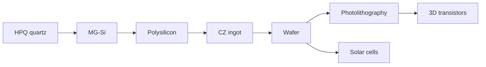

## Supply chain

```mermaid
flowchart LR
  A[HPQ quartz] --> B[MG-Si]
  B --> C[Polysilicon]
  C --> D[CZ ingot]
  D --> E[Wafer]
  E --> F[Photolithography]
  F --> G[3D transistors]
  E --> H[Solar cells]
```

Explore each stage from the sidebar, or use the [introduction](/en/introducao) for market context and interactive USGS data.

