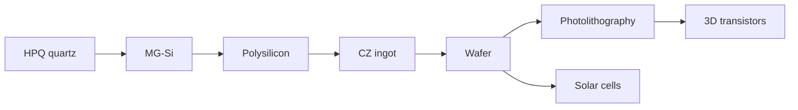

## Supply chain

Explore each stage from the sidebar, or use the [introduction](/en/introducao) for market context and interactive USGS data.

## Reading path

The chain has an order, and the sidebar numbers it. If you are starting out, follow this one:

1. [Introduction](/en/introducao) — the size of the market and why solar and chips need different purities.
2. [The silicon element](/en/o-elemento-silicio) — the constants every later step obeys.
3. [Mining & MG-Si](/en/mineracao-mg-si) — from quartz to metallurgical silicon, in the arc furnace.
4. [Polysilicon](/en/polissilicio) — the chemical purification, and the market it created.
5. [Wafer fabrication](/en/fabricacao-wafers) — the Czochralski ingot becomes a polished wafer.
6. [Crystal structure](/en/estrutura-wafers) — the lattice, doping, and how to read a wafer.
7. [In the fab](/en/na-fab) — the factory as a loop: oxidation, deposition, etch, implant.
8. [Photolithography](/en/fotolitografia) — how the pattern is printed, from DUV to High-NA.
9. [Transistor evolution](/en/transistores) — the fifteen generations, from planar to CFET.
10. [Reliability](/en/confiabilidade) — why a chip stops working.
11. [Packaging and test](/en/empacotamento) — from sliced wafer to sellable product.

The wafer also forks into [photovoltaics](/en/celulas-solares), the other destination for the same material. And once the whole chain is clear, the [Panorama](/en/gargalos) ties price, geography and data together.
