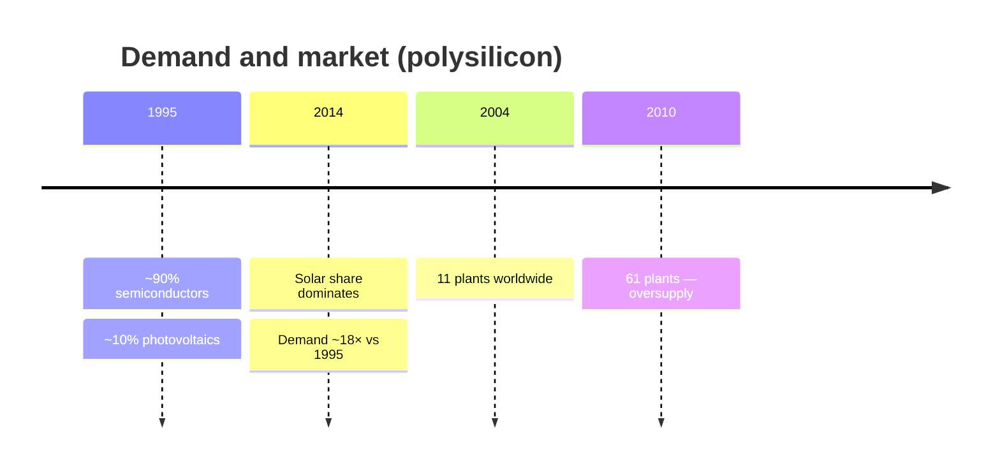
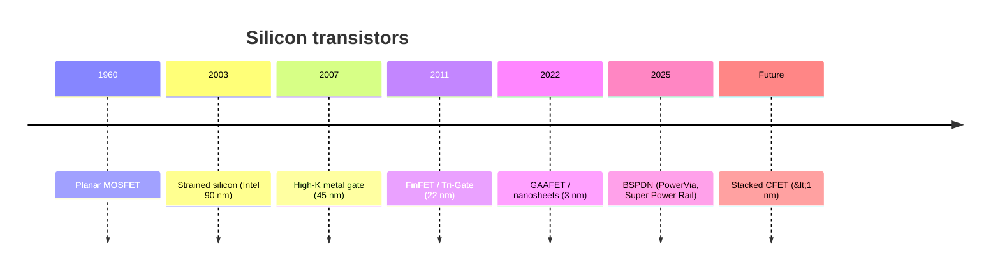

# Timeline

A chronological view of the site's central themes. Full details are in the linked chapters.

## Polysilicon market

More context and Bernreuter charts in [Polysilicon](/en/polissilicio).

## Transistor architecture

All seven generations, with each transistor's structure:

<ClientOnly>
  <TransistorTimeline />
</ClientOnly>

Each era in detail in [Transistor evolution](/en/transistores).

<SeeAlso title="See also" :links="[
  { text: 'Transistor evolution', href: '/en/transistores', note: 'text and figures by era' },
  { text: 'Photolithography', href: '/en/fotolitografia', note: 'patterning on the wafer' },
]" />
