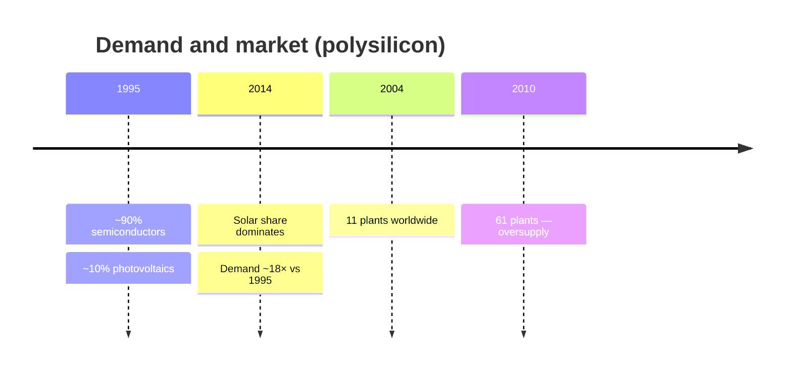

# Timeline

A chronological view of the site's central themes. Full details are in the linked chapters.

## Polysilicon market

More context and Bernreuter charts in [Polysilicon](/en/polissilicio).

## Transistor architecture

All fifteen generations, each with the transistor's structure and examples of the products that used it. The component below is generated from the same list the [transistor evolution](/en/transistores) chapter uses, so the chronology and the chapter cannot diverge — click to enlarge:

<ClientOnly>
  <TransistorTimeline />
</ClientOnly>

Each era in detail in [Transistor evolution](/en/transistores).

<SeeAlso title="See also" :links="[
  { text: 'Transistor evolution', href: '/en/transistores', note: 'main architectures in detail' },
  { text: 'Photolithography', href: '/en/fotolitografia', note: 'patterning on the wafer' },
  { text: 'History of photolithography', href: '/en/historia-fotolitografia', note: 'from contact printing to EUV' },
]" />
