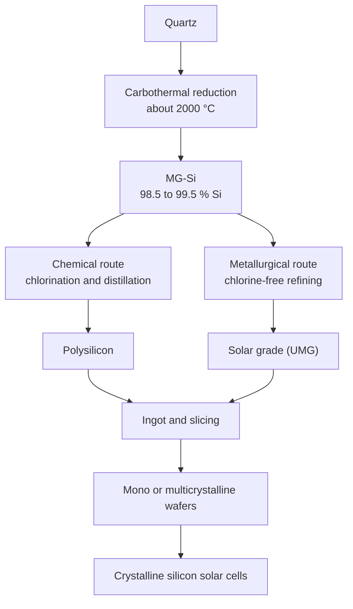

# Chemical purification and polysilicon

Metallurgical-grade silicon ([MG-Si](/en/glossario)) contains metallic and dopant impurities that severely affect the performance of semiconductors and solar panels <Cite id="energy-central" />. To reach **polysilicon** grade (polycrystalline silicon of very high purity), it must be chemically refined <Cite id="csiro" />.

The raw material was never the bottleneck: silicon is the **second most abundant element in the Earth's crust**, behind oxygen only <Cite id="pv-mfg-polysilicon" />. All of the value in this step lies in separating from the silicon the few atoms of boron, phosphorus and metals that ruin a transistor or a solar cell — and no physical filtration can do that job.

## Overview of the route

<DiagramFigure src="/assets/polysilicon-process.svg" alt="Flow chart of the polysilicon route: quartz and carbon in the arc furnace, ground MG-Si, fluidized bed chlorination forming trichlorosilane, fractional distillation, and deposition in either the Siemens reactor or the fluidized bed reactor">
The full route: quartz becomes crude silicon in the arc furnace; crude silicon becomes a gas so that it can be distilled; and the gas becomes solid silicon again — now ultrapure — in the deposition reactors.
</DiagramFigure>

The principle that organises the route is counter-intuitive: **silicon is not purified as a solid, but as a gas**. Turning it into trichlorosilane, whose boiling point is just **31.8 °C**, allows **fractional distillation** — the same technology used in oil refineries — to separate impurities that no filter could hold back <Cite id="pv-mfg-polysilicon" />. Purifying a gas and then solidifying it again is what separates metallurgical-grade silicon from solar- or electronic-grade silicon.

### Two routes out of the same MG-Si

It is worth fixing the map before the details, because there is more than one way out of MG-Si — and the difference between them is whether or not chlorine is involved <Cite id="saimm" />:



This page follows the **chemical route**, which dominates the market and is the only one that reaches electronic grade. The **metallurgical route** — which produces upgraded metallurgical-grade (UMG) solar silicon without touching chlorine — is covered further down.

## From the arc furnace to MG-Si

The step before this page already delivers the starting material. Quartz (SiO₂) is reduced with carbon in a **submerged electric arc furnace** at about 2000 °C <Cite id="csiro" />, in a sequence of reactions where silicon carbide (SiC) is an essential intermediate:

```text
SiO₂ + 3C → SiC + 2CO (g)          (upper region, ~1600 °C)
SiO₂ + 2SiC → 3Si + 2CO (g)        (lower region, >1780 °C)
```

The detail that explains the furnace's economics is a third reaction, which closes the loop <Cite id="pv-mfg-polysilicon" />:

```text
2SiO₂ + SiC → 3SiO (g) + CO (g)
```

The **silicon monoxide** gas rises together with the CO, recombines in the cooler zones of the charge and regenerates SiO₂ and carbon — which feed the first reaction again. That is why the furnace is practically **self-sufficient in reactants**: it consumes a great deal of electricity, but wastes very little raw material <Cite id="pv-mfg-polysilicon" />.

The product is **MG-Si**, drained from the bottom of the furnace at 98% to 99.5% purity <Cite id="saimm" />. The next step, chlorination, is exactly where impurity stops being a mining problem and becomes a chemistry problem. The details of carbothermal reduction are in [Mining & MG-Si](/en/mineracao-mg-si).

## Conversion to trichlorosilane (TCS)

To become a gas, MG-Si is not melted: it is **ground into a powder**. The grinding is not a detail — it multiplies the surface area exposed to the gas, which is what allows the reaction to happen in seconds rather than hours.

That powder is injected into a **fluidized bed reactor** running at **high pressure and velocity**, where the particles are acted on by **anhydrous hydrochloric acid (HCl)** in the presence of a **catalyst** <Cite id="pv-mfg-polysilicon" />. The result is not a single substance but a **family of chlorosilanes** and other volatile chlorides, of which **trichlorosilane** (TCS, SiHCl₃) is by far the most important <Cite id="pv-mfg-polysilicon" />:

```text
Si + 3HCl → SiHCl₃ + H₂
```

With a boiling point of just **31.8 °C**, TCS leaves the reactor already as a gas <Cite id="ratedpower" />. At the top of the reactor a filter separates the gaseous TCS from the residual hydrogen and HCl <Cite id="pv-mfg-polysilicon" />, and the gas goes on to **fractional distillation**, where the difference in volatility between TCS and the chlorides of boron, phosphorus and metals performs the separation with very high precision <Cite id="ratedpower" />. It is here, and not before, that silicon becomes genuinely pure.

## Processes for obtaining solid polysilicon

The purified TCS gas is converted back into solid, ultra-pure metallic silicon by two main methods.

### Siemens process (CVD)

Created in the 1950s by Siemens and Wacker, it is the dominant method worldwide <Cite id="bernreuter" />. TCS gas is injected together with hydrogen (H₂) into a steel bell-jar reactor where **graphite electrodes** pass current through a **U-shaped silicon core** — the seed <Cite id="pv-mfg-polysilicon" />. That core is electrically heated to about **1100–1150 °C** <Cite id="bernreuter" />, and the TCS undergoes **hydrogen reduction**, in a mechanism equivalent to a **CVD** (*chemical vapour deposition*) process: solid silicon deposits on the seed and grows around it, releasing gaseous HCl <Cite id="pv-mfg-polysilicon" />.

The deposition reaction is exactly the **reverse** of the chlorination that produced the TCS a few steps earlier <Cite id="saimm" />:

```text
SiHCl₃ + H₂ → Si + 3HCl
```

When the process ends, the U-shaped core and the deposited silicon are extracted together and fractured. The rods reach **15 to 20 cm in diameter** <Cite id="ratedpower" /> and the material comes out at **9N** purity or better, ready to be graded <Cite id="pv-mfg-polysilicon" />. It is an extremely energy-intensive process — **above 100 kWh per kilogram** of deposited silicon, with a low yield — which is the main drawback of the method <Cite id="saimm" />.

Purity classes:

- **Solar grade (SoG-Si):** 7N (99.99999%) to 9N — photovoltaic cells <Cite id="ratedpower" />.
- **Electronic grade (EG-Si):** 10N to 11N — semiconductors <Cite id="ratedpower" />.

### Fluidized bed reactor (FBR)

A continuous-flow method in which silicon seed particles are kept suspended by a carrier gas containing monosilane (SiH₄) or TCS <Cite id="bernreuter" />. The gas decomposes at much lower temperatures — **650–700 °C** for monosilane — accumulating silicon on the seeds until granules form and are continuously harvested, with none of the rod-fracturing step. It consumes roughly **90% less electricity** than the Siemens process, produces more silicon per unit of reactor volume and delivers the product in a directly usable form, although it also produces an unwanted fraction of silicon dust <Cite id="bernreuter" /> <Cite id="saimm" />.

Even so, the two processes operate at very different scales: in 2008 the Siemens process accounted for about **78%** of the polysilicon produced worldwide and the fluidized bed for just **16%** <Cite id="saimm" />.

<VideoPressEmbed id="ZlxguS11" title="Animation of the polysilicon production route" />

<SourceNote label="Sources" :ids="['pv-mfg-polysilicon', 'bernreuter', 'ratedpower', 'csiro', 'saimm']" />

*Animation and route schematic: [PV-Manufacturing.org](https://pv-manufacturing.org/silicon-production/polysilicon-production/) — the flow chart above was redrawn from that page's diagram and from its description of the reactions* <Cite id="pv-mfg-polysilicon" />.

### The limits of the chemical route

The chemical route dominates, but it has bills to pay. The most cited is **energy**: chlorination, distillation and Siemens add up to an intensive process. The other is safety and environment — it **handles toxic and corrosive compounds** throughout, such as chlorosilanes and hydrochloric acid <Cite id="saimm" />.

In **2006** the solar industry **overtook the semiconductor industry** as the largest consumer of polysilicon <Cite id="saimm" />. In 2008 world production was approximately **75,000 tonnes**, of which **45,000** went to photovoltaics <Cite id="saimm" />.

## The metallurgical route (UMG)

Not all solar silicon has to go through chlorine. The **metallurgical route** starts from MG-Si itself and refines it through a sequence of metallurgical steps, producing **metallurgical-route solar-grade silicon** — *upgraded metallurgical-grade silicon* (UMG). Its energy consumption is markedly lower than that of the Siemens process <Cite id="saimm" />.

The principle behind it is **segregation**: most metallic elements have a low segregation coefficient in silicon, meaning the solid **rejects the impurity into the liquid** as it crystallises. Two central techniques follow from that — **directional solidification** and **acid leaching** <Cite id="saimm" />. Directional solidification comes with a bonus: it doubles as the **ingot casting** step, mono- or multicrystalline, that later becomes wafers <Cite id="saimm" />.

The problem is that this principle does not hold for everyone. **Boron, carbon, oxygen and phosphorus have high segregation coefficients** and are not pushed out by crystal growth <Cite id="saimm" />. Each needs its own attack:

- **Phosphorus:** it is volatile, so it leaves through **vacuum refining** <Cite id="saimm" />.
- **Boron:** it only leaves through **slag refining** or **plasma refining** — which also remove carbon and oxygen <Cite id="saimm" />.

Because each technique is good at one target and weak at the others, the industry chains **combinations** of steps together <Cite id="saimm" />. Another precaution is to start from already-clean feedstock — purified quartz, carbon black and high-purity electrodes — so as not to introduce new impurities into the product <Cite id="saimm" />.

The route has the potential to become dominant, but in 2008 it accounted for **less than 8%** of solar silicon production <Cite id="saimm" />. The reason is simple: it does not reach electronic grade, so it cannot replace the chemical route for semiconductors.

### An industrial case: Elkem's silicon blocks in Kristiansand

The metallurgical route is not just an academic review exercise. Between **2009 and 2023**, a plant in Kristiansand, in southern Norway, operated at industrial scale what was probably the most successful attempt to produce solar-grade silicon without going through chlorine <Cite id="elkem-solar-route" />.

Elkem had been studying metallurgical routes since the late 1970s and reached the industrialised concept in **2009**. It chains **five stages**, of which **three are purification** <Cite id="elkem-solar-route" /> <Cite id="elkem-lca" />:

1. **Carbothermal reduction** of quartz in an electric arc furnace — the same stage that produces the MG-Si described in the mining chapter;
2. **Slag treatment** at high temperature;
3. **Wet-chemical leaching**, at low temperature;
4. **Directional solidification**, which segregates the residual contaminants;
5. **Post-treatment**, with cleaning and cutting into blocks.

The essential difference from the Siemens process is that **the silicon never passes through a vaporised phase** — there is no distillation of a gas, only successive metallurgy <Cite id="elkem-solar-route" />.

<DiagramFigure src="/assets/elkem-solar-kristiansand.jpg" alt="Exterior view of the Elkem Solar solar-grade silicon plant in Kristiansand, Norway">
The Kristiansand plant (Fiskå), where Elkem industrialised its metallurgical route in 2009. Production began at **5,000 t/year**, rose to **6,000 t/year** in 2011 and had a projected capacity of **~7,500 t/year** <Cite id="elkem-solar-route" />. Bjoertvedt — <a href="https://commons.wikimedia.org/wiki/File:Elkem_Solar_01.JPG" target="_blank" rel="noopener noreferrer">Elkem Solar</a> (CC BY-SA 3.0), Wikimedia Commons.
</DiagramFigure>

The energy gain is the core of the argument. The plant produced silicon with about **70% less energy** than the reference Siemens route, and CO₂-equivalent emissions were between **10 and 30%** of those of the Siemens process — **11 g against 40–150 g of CO₂-eq per kg**, depending on the route and plant location <Cite id="elkem-solar-route" />. The energy payback time of a solar module made from that material was **under one year** <Cite id="elkem-solar-route" />.

Purification evolved too. In the 1980s the product carried nearly **4 ppmw of boron and phosphorus**; typical values reached **0.22 ppmw boron and 0.62 ppmw phosphorus** <Cite id="elkem-solar-route" />. That brought the material — sold under the **ESS™** brand — into **group IV** of the **SEMI PV17-0611** standard, which classifies precisely the qualities of solar-grade silicon <Cite id="elkem-solar-route" />.

In the cell, the practical result was parity with conventional polysilicon: efficiencies of **16.5–17%** in multicrystalline cells and **18–18.5%** in monocrystalline ones, even in blends of 40 to 80% ESS with virgin polysilicon <Cite id="elkem-solar-route" />. The route could also **recycle ingot cuts** (*carbide cuts*) that the solar industry normally discards <Cite id="elkem-solar-route" />.

#### What the product looks like: blocks, not rods

Anyone who visits a Siemens plant sees **rods** of silicon coming out of the reactor. The metallurgical route delivers something else: **blocks**. The product left Norway on **pallets of 24 bricks**, each weighing **10–18 kg** and typically measuring **14–15 cm wide by 15–17 cm high and 27–28 cm long** — pallets of **300–350 kg** <Cite id="rec-solar-epd" />. Those bricks went on to be melted and re-crystallised into mono- or multicrystalline ingots.

The operation had two sites: **Fiskå, in Kristiansand**, produced the solar-grade silicon — around **7,300 tonnes per year** in 2018 — and **Herøya, in Porsgrunn**, turned the material into ingots and blocks for export, mainly to REC's plant in Singapore <Cite id="rec-solar-epd" /> <Cite id="snl-rec" />.

<DiagramFigure src="/assets/heroyha-industripark.jpg" alt="Herøya industrial park in Porsgrunn, Norway">
The **Herøya** industrial park in Porsgrunn, where the Kristiansand silicon was melted into ingots and cut into blocks before heading to Singapore <Cite id="rec-solar-epd" />. Bitjungle — <a href="https://commons.wikimedia.org/wiki/File:Her%C3%B8ya_Industripark.JPG" target="_blank" rel="noopener noreferrer">Herøya Industripark</a> (CC BY-SA 4.0), Wikimedia Commons.
</DiagramFigure>

#### The end of the Norwegian line

The arc ends bitterly. In **November 2023** REC closed polysilicon production in Kristiansand and Porsgrunn, citing **high electricity prices** and accumulated losses of **NOK 335 million** (about **US$ 31 million**); the closure affected around **250 workers** <Cite id="rec-closure-2023" />. In **January 2024** Elkem bought the facilities for **US$ 22 million**, with no plans to revive the previous business model <Cite id="elkem-buys-rec" />.

It is worth being precise about why. The metallurgical route **did not lose on quality** — the cells proved electrical parity with Siemens polysilicon. It lost on economics: the route's cost is dominated by **electricity**, which in Norway spiked with the European energy crisis, while the global polysilicon price collapsed under oversupply. An input rising against a falling selling price is the worst possible setup.

<SourceNote :ids="['elkem-solar-route', 'elkem-lca', 'rec-solar-epd', 'snl-rec', 'rec-closure-2023', 'elkem-buys-rec']" />

## How much purity is actually needed?

The purity classes mentioned above become far more concrete when you look at the numbers. Table I of the Xakalashe and Tangstad review compares the typical chemical analyses of the four products in the chain <Cite id="saimm" />:

| Element | MG-Si (ppm) | Solar grade (ppm) | Polycrystalline solar grade | Electronic grade (ppm) |
| --- | --- | --- | --- | --- |
| **Si** (mass fraction) | 99 % | 99.9999 % | 99.99999 % | 99.999999999 % |
| Fe | 2,000–3,000 | < 0.3 | — | < 0.01 |
| Al | 1,500–4,000 | < 0.1 | — | < 0.0008 |
| Ca | 500–600 | < 0.1 | — | < 0.003 |
| B | 40–80 | < 0.3 | — | < 0.0002 |
| P | 20–50 | < 0.1 | — | < 0.0008 |
| C | 600 | < 3 | — | < 0.5 |
| O | 3,000 | < 10 | — | — |
| Ti | 160–200 | < 0.01 | — | < 0.003 |
| Cr | 50–200 | < 0.1 | — | — |

Reading the table explains why chemical purification exists at all. Iron, the dominant impurity in MG-Si, drops from thousands of ppm to **below 0.01 ppm** at electronic grade; boron, which MG-Si carries in the tens of ppm, has to reach **below 0.0002 ppm** — a fall of more than five orders of magnitude. No metallurgy achieves that; only the distillation of a gas does <Cite id="saimm" />.

Note also that the polycrystalline solar grade column lists **only the silicon content**. That is not an omission: solar grade has **no formal specification**, and what gets published are acceptable impurity concentrations, used as a guideline rather than a standard <Cite id="saimm" />.

## Market dynamics and history

In **1995**, about 90% of global polysilicon demand went to semiconductors and 10% to photovoltaics <Cite id="bernreuter" />. By **2014** the proportions had reversed completely: the photovoltaic sector consumed the overwhelming majority, raising demand from **1,500 tonnes** (1995) to **420,000 tonnes** (2018).

<DiagramFigure src="/pdf-images/p05-1.png" alt="Polysilicon demand, semiconductors vs photovoltaics, 1995 and 2014">
Inversion of market shares and **18.4×** growth between 1995 and 2014 (15.1 kt → 278 kt).
</DiagramFigure>

<SourceNote label="Sources" :ids="['bernreuter']" />

*Between 1995 and 2014, the annual polysilicon demand increased by a factor of 18.4; the ratio between the shares of semiconductors and photovoltaics reversed completely* — chart sources: PV News, Sage Concepts and Bernreuter Research <Cite id="bernreuter" />.

<DiagramFigure src="/pdf-images/p05-2.png" alt="Historical polysilicon price, 1977–2017">
Shortage and oversupply cycles.
</DiagramFigure>

<SourceNote label="Sources" :ids="['bernreuter']" />

That growth during the 2000s made the number of plants jump from **11** (2004) to **61** (2010). The resulting global oversupply caused more than **40 plants** to close in China alone over the following three years <Cite id="bernreuter" />.

From that point on, China consolidated its market leadership by investing heavily in refining technology and in subsidies to lower production costs <Cite id="bernreuter" />.

A note on the present: **2025** brought an attempted price recovery. The consultancy TrendForce projected polysilicon at **CNY 45/kg** for the second quarter, with modules at **CNY 0.70/W** and TOPCon cells rising about **1.7%** month on month <Cite id="trendforce-2025" />. The rise, however, came from an artificial installation rush in China ahead of a regulatory change, not from structural demand — TrendForce itself already expected the reversal in the third quarter <Cite id="trendforce-2025" />. It is this kind of short cycle, against abundant installed capacity, that helps explain why European plants competitive on quality — such as the one in Kristiansand described above — could not sustain themselves.

<SourceNote label="Sources" :ids="['trendforce-2025', 'bernreuter']" />

<SeeAlso title="See also" :links="[
  { text: 'Timeline', href: '/en/linha-do-tempo', note: 'milestones of the polysilicon market' },
  { text: 'Wafer fabrication', href: '/en/fabricacao-wafers', note: 'EG-Si → CZ ingot' },
  { text: 'Mining & MG-Si', href: '/en/mineracao-mg-si', note: 'the arc furnace before purification' },
  { text: 'References', href: '/en/referencias#ref-3', note: 'Bernreuter Research' },
]" />
