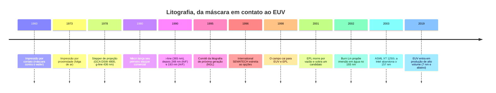

# História da fotolitografia

A litografia óptica passou por quatro arranjos de máquina antes de chegar ao scanner atual <Cite id="kato-litho" />. Esta página conta essa trajetória: como a indústria escolheu uma litografia de próxima geração, por que quase todas as candidatas perderam e por que o **193 nm de 2002 ainda sustenta os nós avançados**. Para como o processo funciona hoje, veja [Fotolitografia](/fotolitografia).

## Linha do tempo

## As quatro gerações ópticas

<DiagramFigure src="/assets/lithography-generations.svg" alt="Comparação entre impressão por contato, por proximidade, por projeção 1:1 e o stepper de redução">
Comparação dos quatro arranjos de máquina. Desenho do autor.
</DiagramFigure>

Nas primeiras décadas, os circuitos integrados eram expostos por **impressão por contato**: a máscara era pressionada **fisicamente** contra o wafer. O arranjo é simples e barato — não usa lente alguma —, mas o contato repetido **danifica a máscara e contamina o wafer** <Cite id="kato-litho" />.

Em **1973** veio a **impressão por proximidade**, que introduz uma folga de ar entre máscara e wafer. O desgaste acaba, mas a difração piora a **resolução** — e ainda sem lente alguma no caminho <Cite id="kato-litho" />. Em seguida, a **impressão por projeção** adicionou **lentes** ao sistema, e foi essa a base do que veio depois <Cite id="kato-litho" />.

Em **1978**, a GCA lançou o **DSW 4800**, o primeiro *stepper* de wafer bem-sucedido: óptica de redução **10×**, lente Zeiss de 0,28 de abertura numérica, campo de 10 × 10 mm e luz de **g-line (436 nm)** <Cite id="kato-litho" />. Em vez de expor o wafer inteiro num disparo, a máquina **anda de campo em campo**. A Nikon lançou seu primeiro stepper comercial em 1980.

O stepper não venceu por ser melhor em tudo. Um stepper 10× fazia cerca de **11 wafers de 100 mm por hora**, contra **40** de um alinhador de projeção, e custava cerca de **US$ 450–600 mil** contra **US$ 240 mil** do concorrente <Cite id="chiphistory-litho" />. Ele ganhou por **custo por die bom** e porque, quando os traços cruzaram a marca de 1 µm, só ele entregava a resolução <Cite id="chiphistory-litho" />. Hoje o mesmo arranjo custa **US$ 50–60 milhões** e processa mais de **200 wafers de 300 mm por hora** <Cite id="chiphistory-litho" />.

### Os comprimentos de onda

<DiagramFigure src="/assets/spectrum-of-lithography-lights.png" alt="Espectro das luzes usadas em litografia: g-line 436 nm, i-line 365 nm, KrF 248 nm, ArF 193 nm e F2 157 nm">
Comparação dos picos de emissão usados em litografia — <a href="https://commons.wikimedia.org/wiki/File:Spectrum_of_lithography_lights.PNG" target="_blank" rel="noopener noreferrer">Spectrum of lithography lights</a>, Shigeru23 (CC BY-SA 4.0), Wikimedia Commons.
</DiagramFigure>

Sozinho, o stepper não sustentaria nada — foi a redução do comprimento de onda que manteve a indústria andando: **g-line (436 nm)** → **i-line (365 nm)**, difundida por volta de 1990 → **248 nm** (KrF) → **193 nm** (ArF), os dois últimos a laser de excímero <Cite id="kato-litho" />.

Por décadas, o comprimento de onda foi **menor** que o tamanho do traço a imprimir. Isso mudou no **nó de 250 nm**, feito com luz de **248 nm**: a partir dali os traços passaram a ser **menores que a própria luz**, e a indústria sobreviveu com **técnicas de realce de resolução** em vez de uma nova fonte <Cite id="asianometry-euv" />. Essa inversão é a origem da pergunta que define o resto desta página: quando a luz não consegue mais desenhar o traço, qual tecnologia consegue?

## A lista de candidatos

Em **1995** a indústria montou um comitê para escolher a **litografia de próxima geração** (*Next Generation Lithography*, NGL) <Cite id="asianometry-euv" />. A mesa reunia cinco ou seis apostas, dependendo de como se contam — e a favorita não era o EUV.

| Candidato | Princípio | Destino |
|---|---|---|
| **EUV** | 13,5 nm refletido por espelhos multicamada | Venceu |
| **EPL / SCALPEL** | Feixe de elétrons projetado através de máscara | Perdeu por vazão |
| **Raio X por proximidade** | Sombreamento com raios X de sincrotron; máscara 1:1 | Descartado |
| **Projeção por íons (IPL)** | Íons acelerados através de máscara de stencil | Descartado |
| **Escrita direta por elétrons** | Feixe desenha direto no wafer, sem máscara | Descartado |
| **157 nm (F₂)** | Último comprimento de onda óptico | Abandonado em 2003 |

O programa da International SEMATECH, criado em **1996**, existia justamente para **estreitar as opções** por consenso global, com revisões de plano técnico, análise de orçamento de erro, custo de propriedade e cronograma, além de uma **pesquisa de opinião** ao fim de cada workshop anual <Cite id="sematech-ngl" />. A meta era estreitar os candidatos **até o fim de 1997** e ter linhas-piloto em **2002**, a tempo do nó de 130/100 nm, com produção em 2004. O processo foi apelidado de **“a decisão do século”** <Cite id="asianometry-euv" />.

## A decisão do século

O calendário escorregou desde o início. Em **novembro de 1997**, a recomendação foi que a escrita direta massivamente paralela ainda **não estava madura** para entrar antes do nó de 50 nm <Cite id="sematech-ngl" />. Em **dezembro de 1998**, no workshop de Colorado Springs, o campo caiu para **dois**: **EUV** e **EPL**, com as atividades em raio X e IPL continuando em outros países <Cite id="sematech-ngl" />.

Em **dezembro de 1999** e **setembro de 2000**, a recomendação foi manter **EUV e EPL** para o nó de **70 nm**, reconhecendo a possibilidade crescente de que a indústria precisasse de **mais de uma** tecnologia de ponta <Cite id="sematech-ngl" />. Em **agosto de 2001**, no quinto e último workshop, a recomendação oficial seguiu sendo **financiar a comercialização das duas** <Cite id="sematech-ngl" />.

Vale registrar a nuance, porque ela costuma se perder na versão popular da história: o EUV **não foi ungido sozinho em 2001**. O que houve foi o **EPL morrer de produtividade**, reduzindo o campo a um candidato por **eliminação** — enquanto a recomendação formal de sustentar as duas frentes ainda constava do relatório daquele ano <Cite id="sematech-ngl" />. O efeito prático foi o alvo do EUV escorregar do nó de **130/100 nm** para o de **70 nm**, uma a duas gerações depois do plano original <Cite id="sematech-ngl" />.

## Por que os concorrentes perderam

**Raio X por proximidade.** Sem óptica de projeção, a máscara precisa ter **o mesmo tamanho** do padrão final — inviável quando os traços chegaram a 100 nm. A máscara tem de ser fina para não absorver nem distorcer, mas fina demais e os raios X a atravessam. E quanto menores os traços, mais perto a máscara precisa ficar do wafer, chegando a exigir folgas **abaixo de 10 µm** — com o wafer se movendo rapidamente durante a exposição. A IBM construiu uma instalação dedicada de cerca de **US$ 500 milhões** e já demonstrava exposições de 0,33 µm em 1991, mas o programa nunca chegou à produção comercial <Cite id="asianometry-euv" />.

A razão está registrada pelos próprios pesquisadores da IBM: gestores de fábrica **sempre preferem a melhoria incremental do óptico** a uma troca drástica de tecnologia, e a migração só viria quando a óptica atingisse o limite <Cite id="asianometry-euv" />. O raio X nunca fez o serviço completo.

**Projeção por íons (IPL).** Íons *scatterizam* menos que fótons e elétrons, o que prometia mais precisão, mas a tecnologia era **imatura**: itens críticos como a máscara ainda não existiam em 1995. A Siemens e a startup vienense IMS desenvolveram a rota dentro do programa MEDEA, que terminou **sem próximos passos** <Cite id="asianometry-euv" />.

**EPL / SCALPEL.** Era a alternativa tecnicamente mais elegante e a que mais tempo resistiu: o SCALPEL nasceu nos Bell Labs em **1989** e provou ser capaz de imprimir traços muito pequenos <Cite id="asianometry-euv" />. O problema era **vazão**. Elétrons são partículas carregadas e se **repelem**; aumentar a corrente para expor mais rápido aumenta o **borrão do feixe** e destrói a resolução. Existe, portanto, um compromisso inerente entre produtividade e resolução <Cite id="spectrum-epl" />. As ferramentas de produção iniciais ficaram em **20 a 30 wafers de 300 mm por hora**, quando a indústria queria **50 a 80** <Cite id="spectrum-epl" />. A ASML chegou a entrar na joint venture **eLith** com a Applied Materials e os Bell Labs, e saiu ao concluir que não sabia contornar o borrão; a eLith encerrou as atividades na sequência <Cite id="eet-euvlith" />.

## O EUV: de raio X mole a consórcio

O EUV nasceu com outro nome. A técnica se chamava **litografia por projeção de raio X mole** até **1993**, quando a comunidade de pesquisa decidiu adotar o termo **extreme ultraviolet**. A troca tinha três motivos: **diferenciar** a técnica da litografia por proximidade de raio X, que não funcionou; **evocar o DUV**, que funcionava; e enterrar a associação negativa com o raio X <Cite id="cset-euv" />. No fundo, EUV são raios X moles com nome de ultravioleta.

<DiagramFigure src="/assets/euvl-tool-llnl.jpg" alt="Ferramenta de litografia EUV do Laboratório Nacional Lawrence Livermore">
Ferramenta de litografia EUV na segunda metade dos anos 1990 — <a href="https://commons.wikimedia.org/wiki/File:Extreme_ultraviolet_lithography_tool.jpg" target="_blank" rel="noopener noreferrer">Extreme ultraviolet lithography tool</a>, Lawrence Livermore National Laboratory (domínio público), Wikimedia Commons.
</DiagramFigure>

As dificuldades técnicas decorrem de uma única propriedade: **tudo absorve EUV**. Não há lente, apenas **espelhos multicamada**; a máscara precisa ser **livre de defeitos**; a fonte precisa de **potência**; e o fotoresistor precisa ser **mais fino**, porque o EUV penetra pouco <Cite id="asianometry-euv" />.

Em **1996**, o Congresso americano cortou o financiamento do Departamento de Energia para o EUV <Cite id="construction-physics-euv" />. A essa altura, uma força-tarefa da SEMATECH havia classificado o EUV como o **último colocado entre quatro** tecnologias, atrás de raio X, feixe de elétrons e projeção por íons <Cite id="construction-physics-euv" />. Em vez de deixar o time dos laboratórios se dispersar, a **Intel assumiu o risco** e, em **setembro de 1997**, montou com AMD e Motorola o consórcio **EUV LLC**, ao lado do *Virtual National Laboratory* — os laboratórios de Berkeley, Livermore e Sandia <Cite id="intel-euvllc" />.

O valor anunciado foi de **US$ 250 milhões em três anos** — US$ 130 milhões em dinheiro e US$ 120 milhões em equipamento, material e pessoal —, o maior investimento privado já feito num projeto do Departamento de Energia dos EUA até então <Cite id="intel-euvllc" />. IBM, Micron, Infineon e a própria ASML entraram depois <Cite id="eet-euvlith" />. A Europa e o Japão responderam com consórcios próprios, o **EUCLIDES** e o **ASET** <Cite id="construction-physics-euv" />.

O candidato que **menos** parecia capaz de durar várias gerações foi o que venceu — e é justamente a continuidade ao longo de várias gerações que explica por que ele venceu.

## O desvio de 157 nm e o resgate pela imersão

Para cobrir o vão entre o óptico e o EUV, a indústria apostou no **157 nm** (laser de F₂), o último comprimento de onda óptico possível. As empresas de laser defenderam a rota em 1998, argumentando que ela adiava a litografia de próxima geração até pelo menos **2010**, e cerca de **US$ 2 bilhões** foram investidos em toda a cadeia <Cite id="asianometry-euv" />.

O 157 nm não era fácil: os materiais de lente de **fluoreto de cálcio**, o fotoresistor e a máscara se mostraram obstáculos substanciais <Cite id="asianometry-euv" />. Enquanto isso, o desvio consumia tempo que o EUV não tinha.

A saída veio de outro lugar. Em **2002**, **Burn Lin**, então na TSMC, apresentou num workshop da SEMATECH sobre 157 nm a proposta de aplicar **imersão em água** à litografia de **193 nm** que já existia. A plateia de mais de 200 pessoas reagiu com entusiasmo, e a SEMATECH assumiu o papel de consolidar as preocupações técnicas levantadas <Cite id="lin-immersion" />. A ideia era quase de graça: trocar o ar entre a última lente e o wafer por **água purificada** reduz o comprimento de onda **efetivo** de 193 nm para cerca de **135 nm** e reaproveita **óptica, máscara e fotoresistor existentes** <Cite id="asml-immersion" />.

A execução foi rápida. Em **outubro de 2003** a ASML já tinha imagens de um protótipo, o **TWINSCAN AT:1150i** <Cite id="asml-immersion" />; em **3 de dezembro** do mesmo ano veio o primeiro pedido do scanner de produção **XT:1250i**, feito pela **TSMC** <Cite id="lin-immersion" />. Em **maio de 2003** a Intel abandonou o 157 nm <Cite id="asianometry-euv" />.

O efeito foi duplo: a imersão salvou o 193 nm e levou a indústria pelos nós de 65, 45, 32 e 22 nm sem precisar do EUV — o que empurrou o EUV ainda mais para frente. Ele só entrou em produção de alto volume nos nós de 7 nm e abaixo, cerca de **duas décadas** depois de ter sido escolhido.

<SourceNote :ids="['kato-litho', 'chiphistory-litho', 'sematech-ngl', 'cset-euv', 'construction-physics-euv', 'intel-euvllc', 'spectrum-epl', 'eet-euvlith', 'lin-immersion', 'asml-immersion', 'asianometry-euv']" />

## Vídeos

<SourceNote label="Vídeos relacionados" :ids="['asianometry-euv']" />

<YouTubeEmbed id="RmgkV83OhHA" title="“The Decision of the Century”: Choosing EUV Lithography" />

<SeeAlso :links="[
  { text: 'Fotolitografia', href: '/fotolitografia', note: 'como o processo funciona hoje' },
  { text: 'Linha do tempo', href: '/linha-do-tempo', note: 'transistores e polissilício' },
  { text: 'Referências', href: '/referencias', note: 'fontes da história' },
]" />
