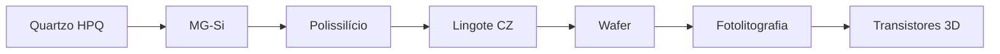

## Cadeia de produção

```mermaid
flowchart LR
  A[Quartzo HPQ] --> B[MG-Si]
  B --> C[Polissilício]
  C --> D[Lingote CZ]
  D --> E[Wafer]
  E --> F[Fotolitografia]
  F --> G[Transistores 3D]
```

Explore cada etapa pela barra lateral ou use a [introdução](/introducao) para contexto de mercado e dados interativos da USGS.

