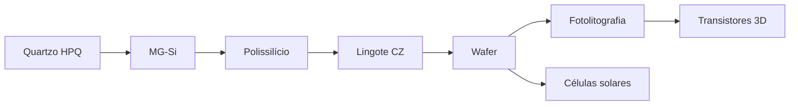

## Cadeia de produção

Explore cada etapa pela barra lateral ou use a [introdução](/introducao) para contexto de mercado e dados interativos da USGS.

## Trilha de leitura

A cadeia tem uma ordem, e a barra lateral a numera. Se você está começando, siga esta:

1. [Introdução](/introducao) — o tamanho do mercado e por que solar e chip exigem purezas diferentes.
2. [O elemento silício](/o-elemento-silicio) — as constantes que todas as etapas seguintes obedecem.
3. [Mineração e MG-Si](/mineracao-mg-si) — do quartzo ao silício metalúrgico, no forno de arco.
4. [Polissilício](/polissilicio) — a purificação química, e o mercado que ela criou.
5. [Fabricação de wafers](/fabricacao-wafers) — o lingote Czochralski vira lâmina polida.
6. [Estrutura e tipos](/estrutura-wafers) — a rede cristalina, a dopagem e como ler um wafer.
7. [Na fab](/na-fab) — a fábrica como laço: oxidação, deposição, corrosão, implantação.
8. [Fotolitografia](/fotolitografia) — como o desenho é impresso, do DUV ao High-NA.
9. [Evolução dos transistores](/transistores) — as quinze gerações, do planar ao CFET.
10. [Confiabilidade](/confiabilidade) — por que um chip deixa de funcionar.
11. [Empacotamento e teste](/empacotamento) — do wafer fatiado ao produto vendável.

O wafer também se divide para a [fotovoltaica](/celulas-solares), que é o outro destino do mesmo material. E, quando a cadeia toda já estiver clara, o [Panorama](/gargalos) amarra preço, geografia e dados.
