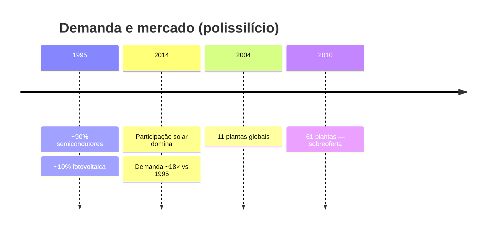
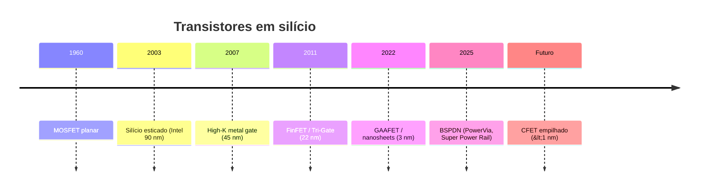

# Linha do tempo

Visão cronológica dos temas centrais do site. Detalhes completos nos capítulos linkados.

## Mercado de polissilício

Mais contexto e gráficos Bernreuter em [Polissilício](/polissilicio).

## Arquitetura dos transistores

<ClientOnly>
  <TransistorCompare />
</ClientOnly>

Veja também

<ul>
  <li><a href="/transistores">Evolução dos transistores</a> — texto e figuras por era</li>
  <li><a href="/fotolitografia">Fotolitografia</a> — padrões no wafer</li>
</ul>

