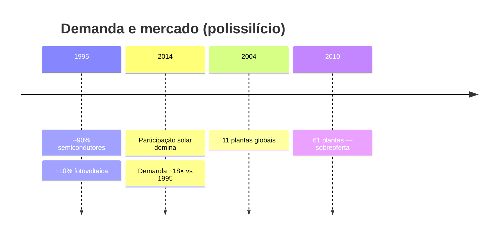
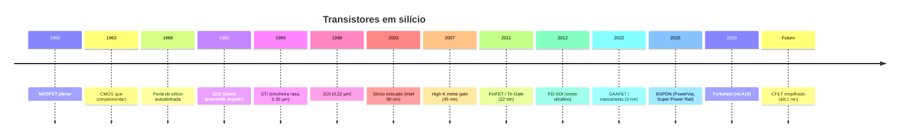

# Linha do tempo

Visão cronológica dos temas centrais do site. Detalhes completos nos capítulos linkados.

## Mercado de polissilício

Mais contexto e gráficos Bernreuter em [Polissilício](/polissilicio).

## Arquitetura dos transistores

As quatorze gerações, com a estrutura de cada transistor e exemplos de produtos que a usaram (clique para ampliar):

<ClientOnly>
  <TransistorTimeline />
</ClientOnly>

Cada era em detalhe em [Evolução dos transistores](/transistores).

<SeeAlso :links="[
  { text: 'Evolução dos transistores', href: '/transistores', note: 'arquiteturas principais em detalhe' },
  { text: 'Fotolitografia', href: '/fotolitografia', note: 'padrões no wafer' },
  { text: 'História da fotolitografia', href: '/historia-fotolitografia', note: 'do contato ao EUV' },
]" />
