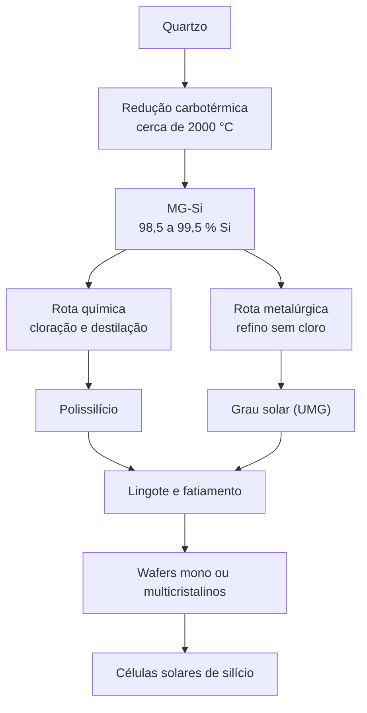

# Purificação química e polissilício

O Silício de Grau Metalúrgico ([MG-Si](/glossario)) contém impurezas metálicas e dopantes que afetam severamente o desempenho de semicondutores e painéis solares <Cite id="energy-central" />. Para atingir o grau de **polissilício** (silício policristalino de altíssima pureza), ele deve ser refinado quimicamente <Cite id="csiro" />.

A matéria-prima nunca foi o gargalo: o silício é o **segundo elemento mais abundante da crosta terrestre**, atrás apenas do oxigênio <Cite id="pv-mfg-polysilicon" />. Todo o valor desta etapa está em separar do silício os poucos átomos de boro, fósforo e metais que arruínam um transistor ou uma célula solar — e nenhuma filtragem física dá conta disso.

## Visão geral da rota

<DiagramFigure src="/assets/polysilicon-process.svg" alt="Fluxograma da rota do polissilício: quartzo e carbono no forno de arco, MG-Si moído, cloração em leito fluidizado formando triclorossilano, destilação fracionada e deposição no reator Siemens ou no reator de leito fluidizado">
A rota completa: o quartzo vira silício bruto no forno de arco, o silício bruto vira gás para poder ser destilado, e o gás volta a ser silício sólido, agora ultrapuro, nos reatores de deposição.
</DiagramFigure>

**O silício se purifica como gás, não como sólido.** Convertido em triclorossilano, que ferve a **31,8 °C**, ele pode ser separado por **destilação fracionada**, o mesmo método das refinarias de petróleo, de impurezas que nenhum filtro reteria <Cite id="pv-mfg-polysilicon" />. Destilar o gás e depositar o sólido de novo é o que leva o silício metalúrgico ao grau solar ou eletrônico.

### Duas rotas a partir do mesmo MG-Si

O MG-Si tem mais de um caminho adiante. A divisão é se o passo seguinte usa cloro <Cite id="saimm" />:



Esta página percorre a **rota química**, que domina o mercado e é a única que chega ao grau eletrônico. A **rota metalúrgica** — que produz o silício de grau solar *upgraded* (UMG) sem passar por cloro — é tratada mais adiante.

## Do forno de arco ao MG-Si

A etapa anterior a esta página já entrega o material de partida. O quartzo (SiO₂) é reduzido com carbono em um **forno elétrico de arco submerso** a cerca de 2000 °C <Cite id="csiro" />, numa sequência de reações em que o carbeto de silício (SiC) é um intermediário essencial:

```text
SiO₂ + 3C → SiC + 2CO (g)          (região superior, ~1600 °C)
SiO₂ + 2SiC → 3Si + 2CO (g)        (região inferior, >1780 °C)
```

O detalhe que explica a economia do forno é uma terceira reação, que fecha o ciclo <Cite id="pv-mfg-polysilicon" />:

```text
2SiO₂ + SiC → 3SiO (g) + CO (g)
```

O **monóxido de silício** gasoso sobe junto com o CO, recombina-se nas zonas frias da carga e regenera SiO₂ e carbono — que voltam a alimentar a primeira reação. Por isso o forno é praticamente **autossuficiente em reagentes**: consome energia elétrica em grande quantidade, mas desperdiça pouca matéria-prima <Cite id="pv-mfg-polysilicon" />.

O produto é o **MG-Si**, drenado pelo fundo do forno com pureza de 98% a 99,5% <Cite id="saimm" />. O passo seguinte, a cloração, é justamente onde a impureza deixa de ser um problema de minério e passa a ser um problema de química. Os detalhes da redução carbotérmica estão em [Mineração e MG-Si](/mineracao-mg-si).

## Conversão em triclorossilano (TCS)

Para virar gás, o MG-Si é **moído até virar pó**, em vez de fundido. A moagem multiplica a superfície exposta ao gás, e a reação corre em segundos em vez de horas.

Esse pó é injetado em um **reator de leito fluidizado** operando com **alta pressão e velocidade**, onde partículas sofrem a ação de um **gás clorídrico anidro (HCl)** na presença de um **catalisador** <Cite id="pv-mfg-polysilicon" />. O resultado não é uma substância só, mas uma **família de clorossilanos** e outros cloretos voláteis, dos quais o **triclorossilano** (TCS, SiHCl₃) é de longe o mais importante <Cite id="pv-mfg-polysilicon" />:

```text
Si + 3HCl → SiHCl₃ + H₂
```

A reação roda na faixa de **300 a 600 °C**, sob pressão de **0,18 a 0,5 MPa** — comprimir o leito aumenta a fração de TCS no gás de saída, e o ótimo experimental fica em torno de **0,4 MPa** <Cite id="jarkin-2021" />. O número que o setor persegue é a **conversão do HCl**: nas gerações mais recentes de reator da Wacker ela se aproxima de **100%**, e a seletividade para TCS passa de **95%** com o carregamento extra de leito (*turbo loading*) <Cite id="jarkin-2021" />.

O que sai do reator, porém, não é TCS puro. Junto com ele vêm **tetracloreto de silício** (SiCl₄, ou STC), **diclorossilano** (H₂SiCl₂) e compostos de ponto de ebulição alto com ligações Si–Si, entre eles o **hexaclorodissilano** (Si₂Cl₆) <Cite id="jarkin-2021" /> <Cite id="wikipedia-tcs" />. Cada um tem seu próprio ponto de ebulição — e é justamente isso que a destilação logo adiante vai explorar para separá-los.

Existe um segundo caminho até o TCS, que dispensa o HCl e reaproveita o próprio STC <Cite id="wikipedia-tcs" />:

```text
Si + 3SiCl₄ + 2H₂ → 4SiHCl₃
```

As duas rotas convivem na indústria, e a escolha entre elas é decisão de projeto de planta, não de bancada. A conversão do STC entrega TCS mais puro; a hidrocloração é a mais econômica <Cite id="jarkin-2021" />. Comparadas por quilo de SiHCl₃ produzido, as duas opções para reaproveitar o STC ficam assim <Cite id="jarkin-2021" />:

| Parâmetro | Hidrocloração (Si + SiCl₄ + H₂) | Conversão do STC (SiCl₄ + H₂) |
| --- | --- | --- |
| Temperatura de reação | 400–600 °C | 1200–1300 °C |
| Taxa de conversão | 23–28% | 17–22% |
| Energia por kg de SiHCl₃ | 0,4–0,7 kWh | 2,0–3,5 kWh |
| Campanha contínua | 150–330 dias | ~120 dias |

É por isso que plantas grandes raramente escolhem uma só: acima de 10.000 t/ano o caminho usual é o **método híbrido**, combinando reatores de síntese direta com reatores de hidrocloração <Cite id="jarkin-2021" />.

Com ponto de ebulição de apenas **31,8 °C**, o TCS sai do reator já como gás <Cite id="ratedpower" /> <Cite id="wikipedia-tcs" />. No topo do reator um filtro separa o TCS gasoso do hidrogênio e do HCl residual <Cite id="pv-mfg-polysilicon" />, e o gás segue para **destilação fracionada**, onde a diferença de volatilidade entre o TCS e os cloretos de boro, fósforo e metais faz a separação com altíssima precisão <Cite id="ratedpower" />. É aqui, e não antes, que o silício se torna realmente puro.

## Processos de obtenção do polissilício sólido

O gás TCS purificado é convertido de volta a silício metálico sólido e ultra-puro por dois métodos principais.

### Processo Siemens (CVD)

Criado na década de 1950 pelas empresas Siemens e Wacker, é o método dominante no mercado mundial <Cite id="bernreuter-production" />. O gás TCS é injetado com hidrogênio (H₂) em um reator de redoma de aço onde **eletrodos de grafita** fazem passar corrente por um **núcleo de silício em forma de “U”** — a semente <Cite id="pv-mfg-polysilicon" />. Esse núcleo é aquecido eletricamente a cerca de **1100–1150 °C** <Cite id="bernreuter-production" />, e o TCS sofre **redução por hidrogênio**, num mecanismo equivalente ao de um **CVD** (*chemical vapour deposition*): o silício sólido se deposita sobre a semente e cresce ao redor dela, liberando HCl gasoso <Cite id="pv-mfg-polysilicon" />.

<DiagramFigure src="/assets/siemens-reactor.svg" alt="Corte do reator Siemens de redoma: à esquerda, a redoma de aço com duas hastes de silício em U incandescentes sobre eletrodos de grafita, gás TCS e hidrogênio entrando pela base e gás gasto saindo pelo topo; à direita, ampliação da superfície da haste mostrando o silício se depositando sobre ela">
O reator Siemens em corte. À esquerda, a redoma de aço fechada: os eletrodos de grafita atravessam a base e aquecem por efeito Joule os filamentos de silício em “U”, que incandescem a 1100–1150 °C enquanto o TCS e o hidrogênio sobem entre eles. À direita, a ampliação da superfície da haste: a redução do TCS deposita silício sobre o filamento, que engorda até virar bastão. Desenho do autor, a partir de Bernreuter Research e PV-Manufacturing.org <Cite id="bernreuter-production" /> <Cite id="pv-mfg-polysilicon" />.
</DiagramFigure>

A reação de deposição é exatamente a **inversa** da cloração que produziu o TCS alguns passos antes <Cite id="saimm" />:

```text
SiHCl₃ + H₂ → Si + 3HCl
```

Quando o processo termina, a **redoma de aço é erguida** e o conjunto — núcleo em “U” e silício depositado — é retirado inteiro e fraturado em pedaços menores <Cite id="bernreuter-production" />. Os bastões atingem de **15 a 20 cm de diâmetro** <Cite id="bernreuter-production" /> e o material sai com pureza de **9N** ou mais, pronto para ser classificado <Cite id="pv-mfg-polysilicon" />.

O processo gasta **mais de 100 kWh por quilograma** de silício depositado, com rendimento baixo. Esse gasto de energia é a principal desvantagem <Cite id="saimm" />. Alternativas foram tentadas por décadas. Um levantamento de 1985 listava **17 rotas** além do Siemens, e poucas chegaram à produção <Cite id="bernreuter-production" />. Desde 2004 a fatia do processo no mercado global **só ficou abaixo de 90% uma vez**, em 2008, no pico da escassez <Cite id="bernreuter-production" />. A química ficou. Quem opera o reator mudou. Plantas chinesas, com eletricidade barata e equipamento doméstico, levaram o **custo de produção** a menos de **US$ 10 por quilograma** <Cite id="bernreuter-production" />.

Classes de pureza <Cite id="bernreuter-production" />:

- **Grau solar para multicristalino** (*multi grade*): 7N (99,99999%) a 8N — células multicristalinas;
- **Grau solar para monocristalino** (*mono grade*): 9N a 10N — células monocristalinas;
- **Grau eletrônico (EG-Si)**: 10N a 11N — semicondutores.

### Reator de leito fluidizado (FBR)

<DiagramFigure src="/assets/fbr-reactor.svg" alt="Corte do reator de leito fluidizado: sementes de silício caem pelo topo, o gás silano injetado pela base mantém as partículas suspensas, aquecedores nas paredes mantêm 650 a 700 °C e os grânulos crescem até serem retirados continuamente pelo fundo">
O reator de leito fluidizado em corte. As sementes entram por cima e caem; o silano injetado pela base sobe e mantém as partículas suspensas, de modo que cada grão fica cercado de gás fresco o tempo todo. Os aquecedores de parede mantêm 650–700 °C, e o silício vai se acumulando nas sementes — que engordam à medida que descem — até serem retiradas continuamente pelo fundo. Desenho do autor, a partir de Bernreuter Research <Cite id="bernreuter-production" />.
</DiagramFigure>

Método de fluxo contínuo em que partículas semente de silício são mantidas suspensas por gás portador contendo monossilano (SiH₄) ou TCS <Cite id="bernreuter-production" />. O gás se decompõe a temperaturas bem menores — **650–700 °C** no caso do monossilano —, acumulando silício nas sementes até formarem grânulos colhidos continuamente, sem a etapa de fratura dos bastões. Consome cerca de **90% menos energia elétrica** que o Siemens, produz mais silício por volume de reator e entrega o produto já numa forma utilizável, embora gere uma fração indesejada de poeira de silício <Cite id="bernreuter-production" /> <Cite id="saimm" />.

Há uma diferença de química dentro da própria família FBR. A REC Silicon alimenta seus reatores com **monossilano (SiH₄)**, que se decompõe a **650–700 °C**; a unidade menor da Wacker trabalha com **TCS**, que só reage por volta de **1000 °C** <Cite id="bernreuter-production" />. Temperatura menor significa menos energia — é daí que sai o argumento de consumir **um décimo** da eletricidade de um forno de hastes convencional <Cite id="bernreuter-production" />.

Os grânulos também preenchem o cadinho melhor do que pedaços irregulares. Misturar grânulos de FBR a pedaços de Siemens numa proporção de **50:50** pode **encurtar em 40%** o tempo de carga e **aumentar em 30%** o peso da carga <Cite id="bernreuter-production" />.

A tecnologia existe desde antes da escassez: a MEMC Electronic Materials já produzia grânulos em Pasadena, no Texas <Cite id="bernreuter-production" />. Poucas empresas, porém, conseguiram escalar. A REC Silicon operou uma planta em **Moses Lake, Washington (2009)** e outra em **Yulin, Shaanxi (2017)**, esta numa *joint venture* com a Shaanxi Non-Ferrous Tianhong New Energy <Cite id="bernreuter-production" />. Quatro obstáculos explicam a penetração limitada <Cite id="bernreuter-production" />:

- a tecnologia é protegida por **muitas patentes**;
- a **fluidodinâmica** é complexa e exige tempo, experiência e capital para escalar do laboratório ao piloto e ao industrial;
- é preciso um **revestimento interno** para que o material da parede não contamine os grânulos — o que encarece o reator;
- e a vantagem elétrica pode ser **consumida pela fração de poeira de silício** que não vira produto.

Ainda assim, a escala dos dois processos é muito diferente: em 2008, o Siemens respondia por cerca de **78%** do polissilício produzido no mundo e o leito fluidizado por apenas **16%** <Cite id="saimm" />.

### O ciclo do cloro: o que realmente se consome

Olhar as duas reações lado a lado revela o truque que faz a rota química fechar. A cloração consome HCl e produz TCS; a deposição consome TCS e devolve HCl:

```text
Si + 3HCl → SiHCl₃ + H₂        (cloração)
SiHCl₃ + H₂ → Si + 3HCl        (deposição)
```

O HCl que sai do reator de deposição **não é resíduo**: é o próprio reagente que alimenta o reator de cloração. Somando as duas equações, o HCl desaparece dos dois lados e sobra apenas a transformação que interessa — **silício bruto entra, silício puro sai** <Cite id="wikipedia-tcs" />.

<DiagramFigure src="/assets/chlorine-loop.svg" alt="Diagrama do ciclo do cloro em quatro etapas: cloração do silício bruto com HCl, destilação do TCS, deposição que devolve silício sólido e HCl, e reciclagem do tetracloreto de silício de volta a TCS; setas mostram o HCl e o SiCl4 retornando ao início">
O ciclo do cloro. O silício bruto entra na etapa 1 e o polissilício sai na etapa 3 — são as duas únicas pontas abertas do sistema. Todo o resto circula: o HCl liberado na deposição volta para a cloração, e o tetracloreto de silício separado na destilação é reconvertido em TCS em vez de descartado. Desenho do autor, a partir de Wikipedia (trichlorosilane) e Jarkin et al. <Cite id="wikipedia-tcs" /> <Cite id="jarkin-2021" />.
</DiagramFigure>

O mesmo vale para o subproduto mais incômodo da cloração, o **tetracloreto de silício** (SiCl₄). Em vez de sair como efluente clorado, ele volta ao processo por **hidrocloração**, junto com hidrogênio e mais silício bruto <Cite id="wikipedia-tcs" /> <Cite id="jarkin-2021" />.

E os volumes não são pequenos. Para cada quilo de polissilício produzido, o estágio de síntese direta gera de **2 a 5 kg** de SiCl₄, e o estágio de deposição outros **11 a 14 kg** <Cite id="jarkin-2021" />. Sem o reciclo, uma planta seria ao mesmo tempo uma fábrica de polissilício e uma fábrica de tetracloreto, nesta última numa proporção de dez para um. É por isso que uma planta de polissilício se mede pela **energia** que consome, e não pela matéria-prima que descarta: o cloro circula, e o que o sistema perde como resíduo é bem menos do que a equação do reator sugere.

<VideoPressEmbed id="ZlxguS11" title="Animação da rota de produção de polissilício" />

<SourceNote :ids="['pv-mfg-polysilicon', 'bernreuter-production', 'ratedpower', 'csiro', 'saimm']" />

*Animação e esquema da rota: [PV-Manufacturing.org](https://pv-manufacturing.org/silicon-production/polysilicon-production/) — o fluxograma acima foi redesenhado a partir do diagrama dessa página e da descrição das reações* <Cite id="pv-mfg-polysilicon" />.

### Os limites da rota química

A rota química domina, e é cara em **energia**. Cloração, destilação e o reator Siemens se somam. Ela também **manipula compostos tóxicos e corrosivos** o tempo todo, entre eles clorossilanos e ácido clorídrico <Cite id="saimm" />.

O TCS ilustra bem o problema. É um **líquido incolor e volátil** — densidade de 1,34 g/cm³, ponto de fusão de −126,5 °C, ebulição a 31,8 °C — que **reage violentamente com a água**, inclusive com a umidade do ar, liberando ácido clorídrico e calor. A faixa de inflamabilidade em ar vai de **1,2% a 90,5% em volume**, e a autoignição ocorre a apenas **185 °C** <Cite id="icsc-tcs" />. Com ponto de fulgor de **−27 °C**, o líquido já emite vapor inflamável à temperatura ambiente, e esse vapor é **4,7 vezes mais denso que o ar** — ou seja, acumula-se no piso <Cite id="icsc-tcs" />. É por isso que o TCS se armazena e se manuseia sob **gás inerte**, e que as instruções de combate a incêndio da ficha internacional prescrevem explicitamente **não usar água** <Cite id="icsc-tcs" />.

Em **2006** a indústria solar **ultrapassou a de semicondutores** como maior consumidora de polissilício <Cite id="saimm" />. Em 2008, a produção mundial foi de aproximadamente **75 mil toneladas**, das quais **45 mil** foram para fotovoltaica <Cite id="saimm" />.

## A rota metalúrgica (UMG)

Nem todo silício solar precisa passar por cloro. A **rota metalúrgica** parte do próprio MG-Si e o refina com uma sequência de etapas metalúrgicas, produzindo o **silício de grau solar por via metalúrgica** — o *upgraded metallurgical-grade silicon* (UMG). O consumo de energia é sensivelmente menor que o do processo Siemens <Cite id="saimm" />.

O princípio por trás dela é a **segregação**: a maioria dos elementos metálicos tem coeficiente de segregação baixo no silício, ou seja, o sólido **rejeita a impureza para o líquido** conforme cristaliza. Disso saem duas técnicas centrais — a **solidificação direcional** e a **lixiviação ácida** <Cite id="saimm" />. A solidificação direcional tem um bônus: serve também como a etapa de **fundição do lingote**, mono ou multicristalino, que depois vira wafer <Cite id="saimm" />.

O problema é que esse princípio não vale para todo mundo. **Boro, carbono, oxigênio e fósforo têm coeficiente de segregação alto** e não são empurrados para fora pelo crescimento do cristal <Cite id="saimm" />. Cada um exige um ataque próprio:

- **Fósforo:** é volátil, e sai por **refino a vácuo** <Cite id="saimm" />.
- **Boro:** só sai por **refino com escória** ou **refino por plasma** — que de quebra também removem carbono e oxigênio <Cite id="saimm" />.

Como cada técnica é boa em um alvo e fraca nos outros, a indústria encadeia **combinações** de etapas <Cite id="saimm" />. Outro cuidado é partir de matéria-prima já limpa — quartzo purificado, negro de fumo e eletrodos de alta pureza — para não introduzir impureza nova no produto <Cite id="saimm" />.

A rota tem potencial para se tornar dominante, mas em 2008 respondia por **menos de 8%** da produção de silício solar <Cite id="saimm" />. A razão é simples: ela não chega ao grau eletrônico, e por isso não substitui a rota química para semicondutores.

### Um caso industrial: os blocos de silício da Elkem em Kristiansand

Entre **2009 e 2023**, uma planta em Kristiansand, no sul da Noruega, operou em escala industrial uma das poucas rotas sem cloro que de fato entregou silício de grau solar <Cite id="elkem-solar-route" />.

A Elkem vinha estudando rotas metalúrgicas desde o fim dos anos 1970 e chegou ao conceito industrializado em **2009**. Ele encadeia **cinco etapas**, das quais **três são de purificação** <Cite id="elkem-solar-route" /> <Cite id="elkem-lca" />:

1. **Redução carbotérmica** do quartzo em forno de arco elétrico — a mesma etapa que produz o MG-Si descrito no capítulo de mineração;
2. **Tratamento com escória** a alta temperatura;
3. **Lixiviação química a úmido**, a baixa temperatura;
4. **Solidificação direcional**, que segrega os contaminantes residuais;
5. **Pós-tratamento**, com limpeza e corte em blocos.

A diferença essencial em relação ao processo Siemens é que **o silício nunca passa por uma fase vaporizada** — não há destilação de um gás, apenas metalurgia sucessiva <Cite id="elkem-solar-route" />.

<DiagramFigure src="/assets/elkem-solar-kristiansand.jpg" alt="Vista externa da planta de silício grau solar da Elkem Solar em Kristiansand, Noruega">
A planta de Kristiansand (Fiskå), onde a Elkem industrializou sua rota metalúrgica em 2009. A produção começou com **5.000 t/ano**, subiu para **6.000 t/ano** em 2011 e tinha capacidade projetada de **~7.500 t/ano** <Cite id="elkem-solar-route" />. Bjoertvedt — <a href="https://commons.wikimedia.org/wiki/File:Elkem_Solar_01.JPG" target="_blank" rel="noopener noreferrer">Elkem Solar</a> (CC BY-SA 3.0), Wikimedia Commons.
</DiagramFigure>

O ganho energético é o ponto central do argumento. A planta produzia silício com cerca de **70% menos energia** que a rota Siemens de referência, e as emissões de CO₂ equivalente ficavam entre **10 e 30%** das do processo Siemens — **11 g contra 40–150 g de CO₂-eq por kg**, conforme a rota e a localização da planta <Cite id="elkem-solar-route" />. O tempo de retorno energético de um módulo solar feito com esse material ficava **abaixo de um ano** <Cite id="elkem-solar-route" />.

A purificação também evoluiu. Nos anos 1980 o produto carregava quase **4 ppmw de boro e fósforo**; os valores típicos chegaram a **0,22 ppmw de boro e 0,62 ppmw de fósforo** <Cite id="elkem-solar-route" />. Com isso o material — vendido sob a marca **ESS™** — passou a atender ao **grupo IV** da norma **SEMI PV17-0611**, que classifica justamente as qualidades de silício grau solar <Cite id="elkem-solar-route" />.

Na célula, o resultado prático foi paridade com o polissilício convencional: eficiências de **16,5–17%** em células multicristalinas e de **18–18,5%** em monocristalinas, mesmo em misturas de 40 a 80% de ESS com polissilício virgem <Cite id="elkem-solar-route" />. A rota também aceitava **reciclar os cortes de lingote** (*carbide cuts*) que a indústria solar normalmente descarta <Cite id="elkem-solar-route" />.

#### A forma do produto: blocos, não hastes

Quem visita uma planta Siemens vê **hastes** de silício saindo do reator. A rota metalúrgica entrega outra coisa: **blocos**. O produto saía da Noruega em **pallets de 24 blocos**, cada um pesando **10–18 kg** e medindo tipicamente **14–15 cm de largura por 15–17 cm de altura e 27–28 cm de comprimento** — pallets de **300–350 kg** <Cite id="rec-solar-epd" />. Esses blocos seguiam para fusão e re-cristalização em lingotes mono ou multicristalinos.

A operação tinha dois sítios: **Fiskå, em Kristiansand**, produzia o silício grau solar — cerca de **7.300 toneladas por ano** em 2018 — e **Herøya, em Porsgrunn**, transformava o material em lingotes e blocos para exportação, principalmente para a fábrica da REC em Singapura <Cite id="rec-solar-epd" /> <Cite id="snl-rec" />.

<DiagramFigure src="/assets/heroyha-industripark.jpg" alt="Parque industrial de Herøya, em Porsgrunn, Noruega">
O parque industrial de **Herøya**, em Porsgrunn, onde o silício de Kristiansand era fundido em lingotes e cortado em blocos antes de seguir para Singapura <Cite id="rec-solar-epd" />. Bitjungle — <a href="https://commons.wikimedia.org/wiki/File:Her%C3%B8ya_Industripark.JPG" target="_blank" rel="noopener noreferrer">Herøya Industripark</a> (CC BY-SA 4.0), Wikimedia Commons.
</DiagramFigure>

#### O fim da linha norueguesa

O arco termina de forma amarga. Em **novembro de 2023** a REC fechou a produção de polissilício em Kristiansand e Porsgrunn, citando **preços de eletricidade altos** e prejuízos acumulados de **335 milhões de coroas norueguesas** (cerca de **US$ 31 milhões**); o fechamento atingiu cerca de **250 trabalhadores** <Cite id="rec-closure-2023" />. Em **janeiro de 2024** a Elkem comprou as instalações por **US$ 22 milhões**, sem planos de retomar o modelo de negócio anterior <Cite id="elkem-buys-rec" />.

Vale ser preciso sobre o motivo. A rota metalúrgica **não perdeu por qualidade** — as células provaram paridade elétrica com o polissilício Siemens. Perdeu por economia: o custo da rota é dominado pela **eletricidade**, que na Noruega disparou com a crise energética europeia, enquanto o preço global do polissilício despencava diante da sobreoferta. Insumo em alta contra preço de venda em queda é o pior cenário possível.

<SourceNote :ids="['elkem-solar-route', 'elkem-lca', 'rec-solar-epd', 'snl-rec', 'rec-closure-2023', 'elkem-buys-rec']" />

## Quanta pureza é necessária?

As classes de pureza citadas acima ficam mais concretas quando se olham os números. A Tabela I do *review* de Xakalashe e Tangstad compara as análises químicas típicas dos quatro produtos da cadeia <Cite id="saimm" />:

| Elemento | MG-Si (ppm) | Grau solar (ppm) | Grau solar policristalino | Grau eletrônico (ppm) |
| --- | --- | --- | --- | --- |
| **Si** (fração mássica) | 99 % | 99,9999 % | 99,99999 % | 99,999999999 % |
| Fe | 2 000–3 000 | < 0,3 | — | < 0,01 |
| Al | 1 500–4 000 | < 0,1 | — | < 0,0008 |
| Ca | 500–600 | < 0,1 | — | < 0,003 |
| B | 40–80 | < 0,3 | — | < 0,0002 |
| P | 20–50 | < 0,1 | — | < 0,0008 |
| C | 600 | < 3 | — | < 0,5 |
| O | 3 000 | < 10 | — | — |
| Ti | 160–200 | < 0,01 | — | < 0,003 |
| Cr | 50–200 | < 0,1 | — | — |

A leitura da tabela explica por que a purificação química existe. O ferro, impureza dominante no MG-Si, cai de milhares de ppm para **menos de 0,01 ppm** no grau eletrônico; o boro, que o MG-Si carrega em dezenas de ppm, precisa chegar a **menos de 0,0002 ppm** — uma queda de mais de cinco ordens de grandeza. Nenhuma metalurgia faz isso; só a destilação de um gás <Cite id="saimm" />.

Repare também que a coluna do grau solar policristalino lista **apenas o teor de silício**. Não é omissão: o grau solar **não tem especificação formal**, e o que se publica são concentrações aceitáveis de impureza, usadas como referência e não como norma <Cite id="saimm" />.

## Dinâmica e histórico de mercado

### O ciclo do porco (*pork cycle*)

O preço do polissilício não oscila por acaso. Entre **1981 e 2004**, o preço de contrato de longo prazo alternou entre pico e vale num intervalo **notavelmente regular de sete a oito anos** <Cite id="bernreuter-market" />. O padrão tem nome — *pork cycle*, o ciclo do porco — e a causa é sempre a mesma: **o atraso entre o sinal e a resposta**.

<DiagramFigure src="/assets/polysilicon-pork-cycle.svg" alt="Diagrama do ciclo do preço em quatro etapas — escassez, investimento, o atraso de dois a três anos até as plantas entrarem em operação e a sobreoferta — com uma seta de retorno mostrando que o investimento para e a escassez volta; abaixo, um gráfico de linha do preço mostrando o pico em que a decisão de construir é tomada e, dois a três anos depois, o vale em que a capacidade entra em operação">
Por que o preço cicla. O sinal de preço é verdadeiro, mas a resposta chega tarde: uma planta de polissilício leva de dois a três anos entre engenharia, obra e ramp-up. Quando a capacidade finalmente entra em operação, o mercado que a justificava já não existe. Desenho do autor, a partir de Bernreuter Research <Cite id="bernreuter-market" /> <Cite id="bernreuter-pork-cycle" />.
</DiagramFigure>

A indústria é, nas palavras da própria Bernreuter Research, **um superpetroleiro com longa distância de frenagem**: quando a queda do preço sinaliza que se deve parar de investir, a obra já está em andamento e não se interrompe sem prejuízo considerável. O resultado é sobrecapacidade, que acelera a queda. E como ninguém investe enquanto o preço cai, a oferta só reage quando o preço volta a subir — tarde demais <Cite id="bernreuter-market" />.

Antes de 2004, a demanda era dominada pelos semicondutores, com seus próprios ciclos. A explosão da fotovoltaica **encurtou o ciclo pela metade**: o intervalo entre vale e pico caiu de oito para **quatro anos** <Cite id="bernreuter-market" />. Depois, a expansão chinesa de baixo custo praticamente **invalidou o ciclo**, produzindo uma tendência sustentada de sobreoferta interrompida apenas por fases curtas de escassez <Cite id="bernreuter-market" />. O ciclo só voltou quando a retração das instalações na China e o fechamento de mais de uma dúzia de fabricantes em 2018–2019 foram seguidos pela recuperação rápida da demanda no segundo semestre de 2020 <Cite id="bernreuter-pork-cycle" />.

Os extremos recentes mostram o tamanho do movimento: em **junho de 2020** o preço à vista tocou o fundo histórico de **US$ 6,75/kg**; em **agosto de 2022** estava em **US$ 39/kg** — a subida inteira em cerca de dois anos, seguida de nova onda de projetos e, segundo a própria consultoria, de mais um *shakeout* inevitável <Cite id="bernreuter-pork-cycle" />.

### A inversão da demanda

Em **1995**, cerca de 90% da demanda global por polissilício ia para semicondutores e 10% para fotovoltaica <Cite id="bernreuter" />. Em **2014**, a proporção inverteu-se: o setor fotovoltaico passou a consumir a esmagadora maioria, elevando a demanda de **1.500 toneladas** (1995) para **420.000 toneladas** (2018).

<DiagramFigure src="/pdf-images/p05-1.png" alt="Demanda de polissilício semicondutores vs fotovoltaica 1995 e 2014">
Inversão das fatias de mercado e crescimento de **18,4×** entre 1995 e 2014 (15,1 kt → 278 kt).
</DiagramFigure>

<SourceNote :ids="['bernreuter']" />

*Between 1995 and 2014, the annual polysilicon demand increased by a factor of 18.4; the ratio between the shares of semiconductors and photovoltaics reversed completely* — fontes do gráfico no PDF: PV News, Sage Concepts e Bernreuter Research <Cite id="bernreuter" />.

<DiagramFigure src="/pdf-images/p05-2.png" alt="Preço histórico do polissilício 1977–2017">
Ciclos de escassez (*shortage*) e sobreoferta (*oversupply*).
</DiagramFigure>

<SourceNote :ids="['bernreuter']" />

Esse crescimento nos anos 2000 fez o número de plantas saltar de **11** (2004) para **61** (2010) — os projetos brotavam por toda parte, inclusive fora da China, e dezenas fracassaram <Cite id="bernreuter-market" />. A sobreoferta fechou **mais de 40 plantas** entre o fim de 2010 e o início de 2013, a maioria delas na China — que já havia perdido **36 unidades** de pequeno e médio porte em 2011/2012 <Cite id="bernreuter-market" />.

### A ascensão chinesa

Em 2004 a China praticamente não produzia polissilício. Em **2018** já detinha **55%** do volume global; em **2023**, **mais de 90%** <Cite id="bernreuter-market" />. O caminho passou por tarifas. Em **julho de 2013** o Ministério do Comércio chinês (Mofcom) impôs direitos sobre importações dos **Estados Unidos e da Coreia do Sul**, e várias plantas ociosas voltaram a operar. As alíquotas para os dois principais fornecedores coreanos ficaram **abaixo de 3%** — pouco dissuasivas —, enquanto os americanos apanharam com taxas de até **57%**, contornadas por algum tempo pelo regime de *processing trade* e fechadas em agosto de 2014 <Cite id="bernreuter-market" />.

A expansão mudou a natureza do mercado por três forças ao mesmo tempo:

- **Custo de energia.** As novas plantas se concentraram nas regiões autônomas de **Xinjiang e Mongólia Interior**, onde a eletricidade é muito barata — o insumo decisivo de um processo tão intensivo quanto o Siemens. A contrapartida é ambiental: essa eletricidade vem majoritariamente de **usinas a carvão**, e o polissilício produzido carrega uma pegada de carbono alta <Cite id="bernreuter-market" />.
- **Guerra de preços deliberada.** Em 2018, o então presidente da Daqo New Energy, Longgen Zhang, foi explícito sobre a estratégia: das **300.000 toneladas** de capacidade chinesa de 2017, cerca de **100.000** tinham custo baixo, e as outras **200.000** "seriam eliminadas" para dar lugar à capacidade nova <Cite id="bernreuter-market" />.
- **Consumo específico em queda.** A quantidade de silício por watt instalado caiu a tal ponto que o polissilício consumido para cada gigawatt novo em **2023 era um quarto** do que se gastava em 2006. Contribuíram a redução da **espessura do wafer**, a troca da serra de lama pela **serra de fio diamantado** (menos perda de *kerf*), o ganho de eficiência das células, a virada para **células monocristalinas tipo n**, além de cortes de célula e outras melhorias de montagem <Cite id="bernreuter-market" />.

A virada para o monocristalino não foi só técnica. Em **2015** a Administração Nacional de Energia da China lançou o programa **Top Runner**, cujos limites mínimos de eficiência **favoreciam o monocristalino em detrimento do multicristalino** — e isso deu o empurrão que faltava para a Longi e a Zhonghuan escalarem capacidade <Cite id="bernreuter-market" />. Como células monocristalinas, sobretudo tipo n, exigem insumo mais puro, o programa também favoreceu as plantas chinesas de polissilício de melhor qualidade — e manteve aberto um nicho para fornecedores estrangeiros como a Wacker e a OCI <Cite id="bernreuter-market" />.

No fim, o mapa virou geopolítico. Fora da China, o último grande projeto foi a planta da **Wacker no Tennessee (EUA)**, aberta em 2016 mas decidida ainda em 2010, antes de existirem os direitos antidumping americanos <Cite id="bernreuter-market" />. E o **Uyghur Forced Labor Prevention Act** criou um **segmento separado, de preço mais alto**, para polissilício não chinês, reabrindo a conversa sobre capacidade fora do país <Cite id="bernreuter-market" />.

### Uma nota sobre o presente

Em **2025** houve uma tentativa de recuperação de preços. A consultoria TrendForce projetou para o segundo trimestre um polissilício a **CNY 45/kg**, com módulos a **CNY 0,70/W** e células TOPCon subindo cerca de **1,7%** no mês <Cite id="trendforce-2025" />. A alta, porém, veio de um pico artificial de instalações na China antes de uma mudança regulatória, e não de demanda estrutural — a própria TrendForce já previa a reversão para o terceiro trimestre <Cite id="trendforce-2025" />. É esse tipo de ciclo curto, contra capacidade instalada abundante — e num mercado onde mais de 90% da oferta sai de um só país —, que ajuda a explicar por que plantas europeias competitivas em qualidade, como a de Kristiansand descrita acima, não conseguiram se sustentar.

<SourceNote :ids="['trendforce-2025', 'bernreuter', 'bernreuter-market', 'bernreuter-pork-cycle']" />

<SeeAlso :links="[
  { text: 'Linha do tempo', href: '/linha-do-tempo', note: 'marcos do mercado de polissilício' },
  { text: 'Fabricação de wafers', href: '/fabricacao-wafers', note: 'EG-Si → lingote CZ' },
  { text: 'Mineração e MG-Si', href: '/mineracao-mg-si', note: 'o forno de arco antes da purificação' },
  { text: 'Referências', href: '/referencias#ref-3', note: 'Bernreuter Research' },
]" />
